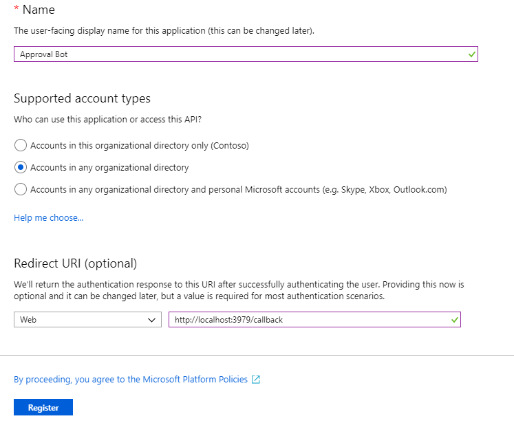
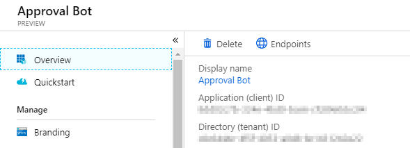
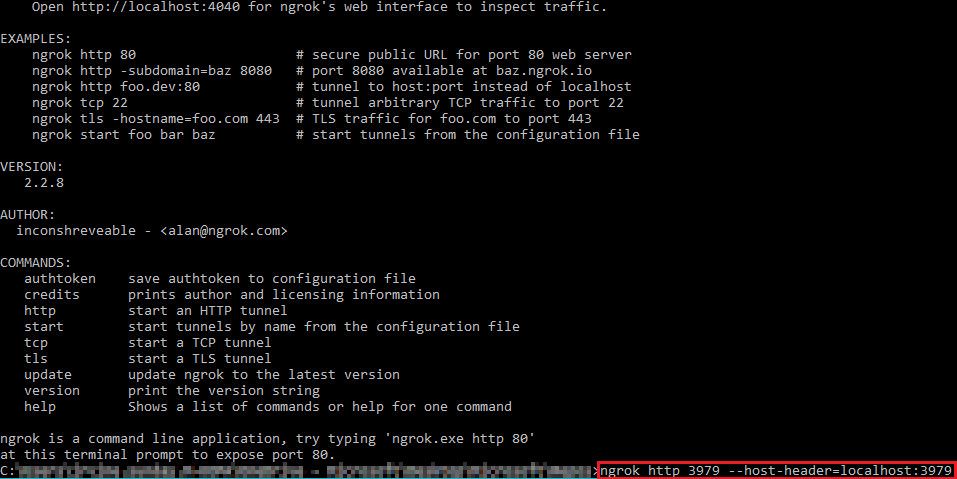
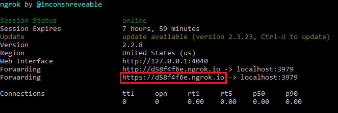

# Approval Bot Sample

## Running locally

Follow these steps to enable running the bot locally for debugging.

### Prerequisites

- [ngrok](https://ngrok.com/)
- [Bot Framework Emulator](https://github.com/Microsoft/BotFramework-Emulator/releases) - **Note:** The installer does not seem to create any shortcuts to the app. I recommend browsing to `%localappdata%\botframework\app-3.5.35\botframework-emulator.exe` and creating a shortcut on your desktop.
- [Azure Cosmos DB Emulator](https://docs.microsoft.com/en-us/azure/cosmos-db/local-emulator)
- Visual Studio 2017

### Register the app

1. Open a browser and navigate to the [Azure Active Directory admin center](https://aad.portal.azure.com). Login using a **Work or School Account**.

1. Select **Azure Active Directory** in the left-hand navigation, then select **App registrations (Preview)** under **Manage**.

    

1. Select **New registration**. On the **Register an application** page, set the values as follows.

    - Set a preferred **Name** e.g. `Approval Bot`.
    - Set **Supported account types** to **Accounts in any organizational directory**.
    - Under **Redirect URI**, set the first drop-down to `Web` and set the value to `http://localhost:3979/callback`.

    

1. Choose **Register**. On the **Approval Bot** page, copy the value of the **Application (client) ID** and save it, you will need it in the next step.

    

1. Select **Certificates & secrets** under **Manage**. Select the **New client secret** button. Enter a value in **Description** and select one of the options for **Expires** and choose **Add**.

    

1. Copy the client secret value before you leave this page. You will need it in the next step.

    > [!IMPORTANT]
    > This client secret is never shown again, so make sure you copy it now.

    

### Set up the ngrok proxy

You must expose a public HTTPS endpoint to receive notifications from the Bot Framework Emulator. While testing, you can use ngrok to temporarily allow messages from the Bot Framework Emulator to tunnel to a *localhost* port on your computer.

You can use the ngrok web interface ([http://127.0.0.1:4040](http://127.0.0.1:4040)) to inspect the HTTP traffic that passes through the tunnel. To learn more about using ngrok, see the [ngrok website](https://ngrok.com/).


1. [Download ngrok](https://ngrok.com/download) for Windows.

1. Unzip the package and run ngrok.exe.

1. Run the following command line on the ngrok console:

    ```Shell
    ngrok http 3979 --host-header=localhost:3979
    ```

    

1. Copy the HTTPS URL that's shown in the console. You'll use this to configure your `NgrokRootUrl` in the sample.

    

    > **Note:** Keep the console open while testing. If you close it, the tunnel also closes and you'll need to generate a new URL and update the sample.

### Configure and run the sample

1. Clone the repository locally.
1. Make a copy of the **./ApprovalBot/PrivateSettings.example.config** file in the same directory, and name the copy `PrivateSettings.config`.
1. Open **ApprovalBot.sln** in Visual Studio, then open the **PrivateSettings.config** file.

1. Paste the ngrok HTTPS URL value copied from the previous step into the value of `NgrokRootUrl` in **PrivateSettings.config**, and save your changes.

    > **IMPORTANT**: Leave ngrok running while you run the sample. If you stop ngrok and re-start it, the forwarding URL changes, and you'll need to update the value of `NgrokRootUrl`.

1. Start the Azure Cosmos DB Emulator. This needs to be running before you start the sample.

1. Press F5 to debug the sample.

1. Run the Bot Framework Emulator. At the top, where it says **Enter your endpoint URL**, enter `https://localhost:3979/api/messages`.

1. That will prompt for app ID and password. Enter your app ID and secret, and leave **Locale** blank.

    

1. Click **Connect**.

1. Send `hi` to confirm the connection.

    

## Limitations when running locally

When running the sample locally, the approval request email that sent is a little different. Because it's not running on a confirmed, registered domain, we must send the message to and from the same account. What that means is that when you get to the point where you request approval, you must include yourself in the list of approvers.

You can include other approvers, but the message they receive won't show the adaptive card. Login to your own mailbox with Outlook to test the adaptive card.

## Contributing

This project welcomes contributions and suggestions.  Most contributions require you to agree to a
Contributor License Agreement (CLA) declaring that you have the right to, and actually do, grant us
the rights to use your contribution. For details, visit https://cla.microsoft.com.

When you submit a pull request, a CLA-bot will automatically determine whether you need to provide
a CLA and decorate the PR appropriately (e.g., label, comment). Simply follow the instructions
provided by the bot. You will only need to do this once across all repos using our CLA.

This project has adopted the [Microsoft Open Source Code of Conduct](https://opensource.microsoft.com/codeofconduct/).
For more information see the [Code of Conduct FAQ](https://opensource.microsoft.com/codeofconduct/faq/) or
contact [opencode@microsoft.com](mailto:opencode@microsoft.com) with any additional questions or comments.

## Copyright

Copyright (c) 2019 Microsoft. All rights reserved.