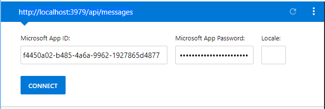
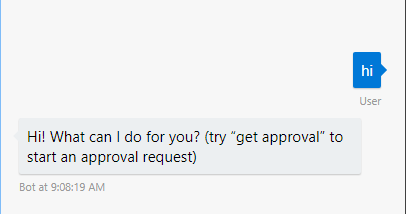

# Approval Bot Sample

## Running locally

Follow these steps to enable running the bot locally for debugging.

### Prerequisites

- [ngrok](https://ngrok.com/)
- [Bot Framework Emulator](https://github.com/Microsoft/BotFramework-Emulator/releases) - **Note:** The installer does not seem to create any shortcuts to the app. I recommend browsing to `%localappdata%\botframework\app-3.5.35\botframework-emulator.exe` and creating a shortcut on your desktop.
- [Azure Cosmos DB Emulator](https://docs.microsoft.com/en-us/azure/cosmos-db/local-emulator)
- Visual Studio 2017

### Setup

1. Clone the repository locally.
1. Make a copy of the **./ApprovalBot/PrivateSettings.example.config** file in the same directory, and name the copy `PrivateSettings.config`.
1. Open **ApprovalBot.sln** in Visual Studio, then open the **PrivateSettings.config** file.
1. Register an app at the [Application Registration Portal](https://apps.dev.microsoft.com). Get an application ID and secret, and add a Web platform with the redirect URL set to `http://localhost:3979/callback`.
1. Set the value of `MicrosoftAppId` to the app ID you just generated, and set the value of `MicrosoftAppPassword` to the secret you just generated.
1. Open a command prompt and run ngrok with the following command line:

    ```Shell
    ngrok http 3979 --host-header=localhost:3979
    ```
1. When ngrok starts up, copy the second **Forwarding** value, which should be an https URL like `https://c8653c26.ngrok.io`. Paste this value in the value of `NgrokRootUrl` in **PrivateSettings.config**, and save your changes.

    > **IMPORTANT**: Leave ngrok running while you run the sample. If you stop ngrok and re-start it, the forwarding URL changes, and you'll need to update the value of `NgrokRootUrl`.

1. Start the Azure Cosmos DB Emulator. This needs to be running before you start the sample.

1. Press F5 to debug the sample.

1. Run the Bot Framework Emulator. At the top, where it says **Enter your endpoint URL**, enter `https://localhost:3979/api/messages`.

1. That will prompt for app ID and password. Enter your app ID and secret, and leave **Locale** blank.

    

1. Click **Connect**.

1. Send `hi` to confirm the connection.

    

## Limitations when running locally

When running the sample locally, the approval request email that sent is a little different. Because it's not running on a confirmed, registered domain, we must send the message to and from the same account. What that means is that when you get to the point where you request approval, you must include yourself in the list of approvers.

You can include other approvers, but the message they receive won't show the adaptive card. Login to your own mailbox with Outlook to test the adaptive card.

## Contributing

This project welcomes contributions and suggestions.  Most contributions require you to agree to a
Contributor License Agreement (CLA) declaring that you have the right to, and actually do, grant us
the rights to use your contribution. For details, visit https://cla.microsoft.com.

When you submit a pull request, a CLA-bot will automatically determine whether you need to provide
a CLA and decorate the PR appropriately (e.g., label, comment). Simply follow the instructions
provided by the bot. You will only need to do this once across all repos using our CLA.

This project has adopted the [Microsoft Open Source Code of Conduct](https://opensource.microsoft.com/codeofconduct/).
For more information see the [Code of Conduct FAQ](https://opensource.microsoft.com/codeofconduct/faq/) or
contact [opencode@microsoft.com](mailto:opencode@microsoft.com) with any additional questions or comments.
